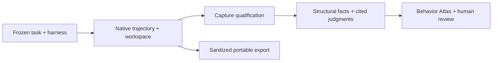

# Engineering Behavior Observatory

### Capture and evaluate how engineering agents work.

EBO captures an agent's native trajectory and workspace changes, then connects
behavioral assessments to the evidence behind them. Use it to investigate a
refactor, compare repeated trials, examine failures, or share a reviewable
record of an open-ended engineering task.

[Quickstart](docs/guides/quickstart.md) · [Documentation](docs/README.md) ·
[CLI reference](docs/reference/cli.md) ·
[Releases](https://github.com/trilogy-group/engineering-behavior-observatory/releases)

## Install

Requires Node.js **24.19.0** and npm. The package is
`engineering-behavior-observatory`; its executable is `ebo`.

```sh
npm install -g engineering-behavior-observatory
ebo --help
```

For a one-off command without a global installation:

```sh
npm exec --package=engineering-behavior-observatory -- ebo --help
```

Avoid `npx ebo`: it resolves a different npm package. For source installation
or a verified release archive, see [the quickstart](docs/guides/quickstart.md).

## What you can do

- Retain messages, tool activity, exposed lifecycle events,
  resource usage, and workspace outcomes. Observational tasks need no reference
  solution or pass/fail verifier.
- Inspect a native record from a normalized event or
  behavioral assertion. Missing evidence stays explicit.
- Extract structural facts, request evidence-grounded
  judgments, record human review, and compare matched conditions.
- Browse the local Behavior Atlas, connect Grafana, build
  HTML reports, and create policy-checked portable trajectory archives.



**Execution completion, capture quality, and task quality are different facts.**
A completed run is not a claim that the task was solved. Native evidence remains
authoritative; derived views never replace it.

## Supported harnesses

| Harness | Integration | What EBO retains |
| :--- | :--- | :--- |
|  **[Claude Agent SDK](docs/harnesses/claude-agent-sdk.md)** | Direct TypeScript SDK · `ebo agent-sdk run` | Native messages, passive lifecycle hooks, session identity, usage, OTLP receipt state, workspace |
|  **[Codex](docs/harnesses/codex-harness.md)** | Owned app-server process over JSON-RPC stdio · `ebo codex run` | Thread/turn/item records, history readback, usage, independently checked OTLP signals |
|  **[Cursor](docs/harnesses/cursor-sdk.md)** | Direct TypeScript SDK · `ebo cursor run` | Stream, callbacks, conversation, official JSONL store, terminal and separate billing evidence |
|  **[Pi](docs/harnesses/pi-sdk.md)** | Direct TypeScript session/extension APIs · `ebo pi run` | Native session tree, tool/message lifecycle, passive observer, compaction, retries, usage |
|  **[OpenHands](docs/harnesses/openhands-agent-server.md)** | Agent Server REST/WebSocket · library API | Stream/final event reconciliation, conversation state, exposed hooks, workspace |
|  **[DeepSeek Harness](docs/harnesses/deepseek-harness.md)** | Official TypeScript JSON-RPC client · library API | Durable session events, lifecycle notifications, selected runtime/plugin composition |

Icons identify the upstream projects or publishers. Support is **capability-specific**:
not every harness exposes the same hooks, histories, or telemetry.
[Choose a harness](docs/harnesses/README.md) for prerequisites and limitations.

## Quickstart

Use a source checkout for the bundled no-credentials demo. Node is pinned in
`.nvmrc`; Git and npm are required.

```sh
git clone https://github.com/trilogy-group/engineering-behavior-observatory.git
cd engineering-behavior-observatory
nvm install
nvm use
npm ci
npm run build
npm link
ebo --help
```

`npm link` installs this checkout's `ebo` command on your active Node
installation's PATH. Rebuild after source changes. Without a global link, use
`npm run ebo -- <arguments>`. For a packaged installation, see
[Install EBO](docs/guides/quickstart.md#install-from-a-release-archive).

### Explore a trajectory report

```sh
node dist/test/atlas-fixture.js .ebo/first-look
ebo corpus query .ebo/first-look/index.jsonl
ebo atlas build .ebo/first-look/atlas.json .ebo/first-report
```

Open `.ebo/first-report/index.html` in your browser. This **synthetic demo**
makes no model calls. It shows evidence drilldown, review states, missing
evidence, and comparison caveats. Use new output paths when repeating it.

### Capture your own task

Prepare an admitted, frozen task packet and a queue with your harness
configuration. Then run one selected entry:

```sh
ebo agent-sdk run study/bundle study/queue.json <run-id> study/runs
```

This is the execution step, not a repository-to-task generator.
[The quickstart](docs/guides/quickstart.md#capture-a-real-task) explains the
required inputs and links to the preparation and authentication guides.
Use the returned bundle path to inspect evidence, derive observations, and export.

## Find your next step

| I want to… | Read |
| :--- | :--- |
| Run a task and recover an interrupted attempt | [Operator guide](docs/guides/operator-guide.md) |
| Inspect or share captured evidence | [Evidence and export](docs/guides/evidence-and-sharing.md) |
| Understand OTLP versus behavioral evidence | [Telemetry](docs/guides/telemetry.md) |
| Explore reports and Grafana dashboards | [Behavior Atlas](docs/guides/atlas.md) |
| Evaluate behavior and compare conditions | [Evaluation workflow](docs/evaluation/README.md) |
| Add an adapter, extractor, or rubric | [Extension contracts](docs/development/extension-contracts.md) |
| Look up command syntax or artifact contracts | [Reference](docs/reference/README.md) |

## Contribute

Read [the contributor guide](docs/development/README.md) and `AGENTS.md`.
The local checks are separate from operating a study:

```sh
npm run build
npm run typecheck
npm test
git diff --check
```

Runtime pins, live verification evidence, packaging, and known limitations live
in the [release records](release/README.md). Study data and credentials stay
outside the source tree and published package.

## License

EBO is licensed under [Apache-2.0](LICENSE). Third-party SDKs, dependencies,
and upstream contract material retain their respective licenses and terms.
