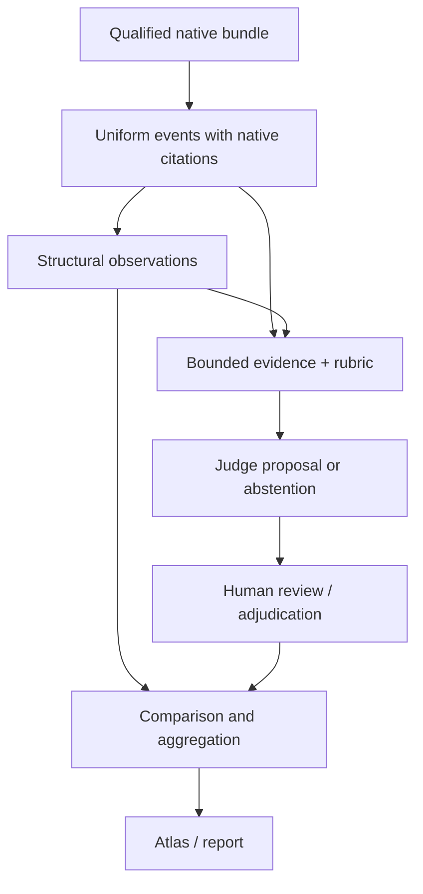

# Evaluate behavior

Start with a captured run and a question: did the agent validate its changes?
How did it respond to a tool failure? Was repeated investigation useful or
redundant? A tool count alone cannot answer those questions.

## Reading path

| Step | Read | Result |
| :--- | :--- | :--- |
| 1. Establish what is observable | [Uniform events](uniform-events.md), [integrity gates](normalization-integrity.md) | Source-bound events, unmapped records, capability coverage |
| 2. Extract exact facts | [Structural observations](structural-observations.md) | Counts, resource observations, explicit denominators and missing values |
| 3. Ask a behavioral question | [Assertions](behavior-assertions.md), [semantic judge](semantic-judge.md) | Cited proposal or abstention for one rubric dimension |
| 4. Review the interpretation | [Human calibration](human-calibration.md) | Human-authored decisions and agreement populations |
| 5. Compare declared conditions | [Aggregation](aggregation.md) | Descriptive distributions, matched differences, exclusions and caveats |
| 6. Explore or report | [Behavior Atlas](../guides/atlas.md) | Local drilldown and reproducible report |

The judge backend is independent of the evaluated harness: choose the Claude
Agent SDK or native Codex backend explicitly. EBO retains the evaluator, rubric,
evidence selection, limits, and configuration identity.

## Keep three questions separate

- **Did execution end?** The terminal record answers this.
- **Did we capture enough evidence?** Qualification and capability coverage
  answer this, separately for each relevant signal.
- **Was the behavior useful?** A cited interpretation and review can address
  this; execution status and counts cannot substitute for it.

A failure followed by another operation is a structural observation, not proof
of recovery. An absent tool family is not necessarily zero activity. Repeated
judge calls are not additional independent engineering trials.

Use the [operator workflow](../guides/operator-guide.md#6-normalize-and-extract-structural-observations)
for commands, and [CLI reference](../reference/cli.md) for complete syntax.
